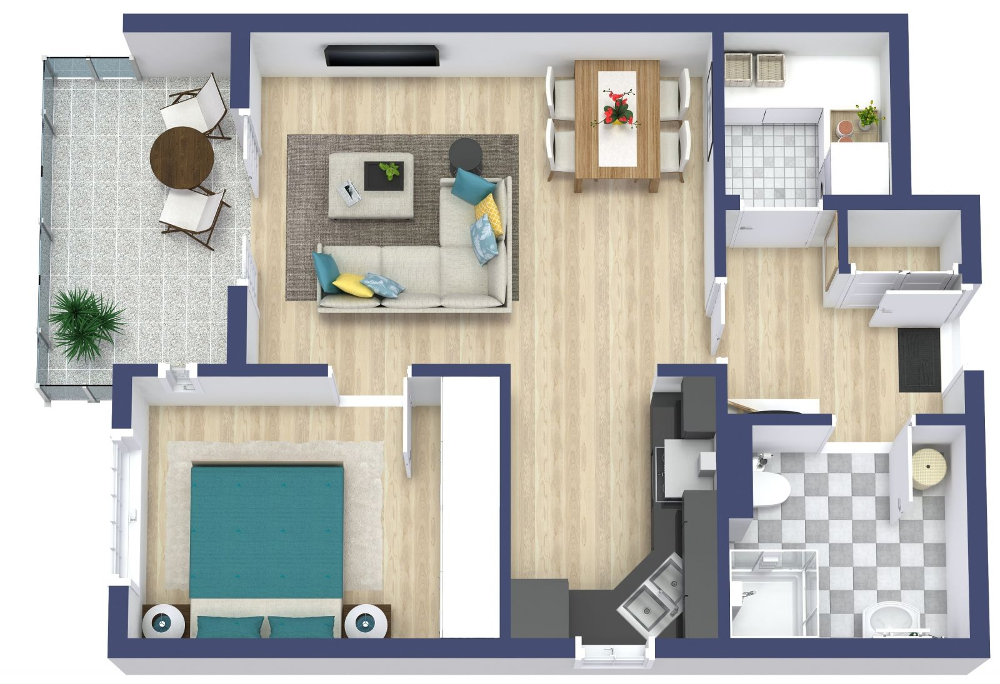

# gazebo_my_world
The First Project for the Udacity's "Robitics SW Engineer" Course. 
The project is about creating a world in `gazebo`. For this project a flat is modeled in gazebo and a sample plan is taken from [roomsketcher.com](https://www.roomsketcher.com/floor-plan-gallery/apartment/1-bedroom-apartment-plans/) (as shown below):

## Project Structure

    .gazebo_my_world                   # Build My World Project 
    ├── model                          # Model files 
    │   ├── Building
    │   │   ├── model.config
    │   │   ├── model.sdf
    │   ├── ServiceRobot
    │   │   ├── model.config
    │   │   ├── model.sdf
    ├── script                         # Gazebo World plugin C++ script      
    │   ├── welcome_message.cpp
    ├── world                          # Gazebo main World containing models 
    │   ├── MyHomeOffice.world
    ├── CMakeLists.txt                 # Link libraries 
    └──                              
