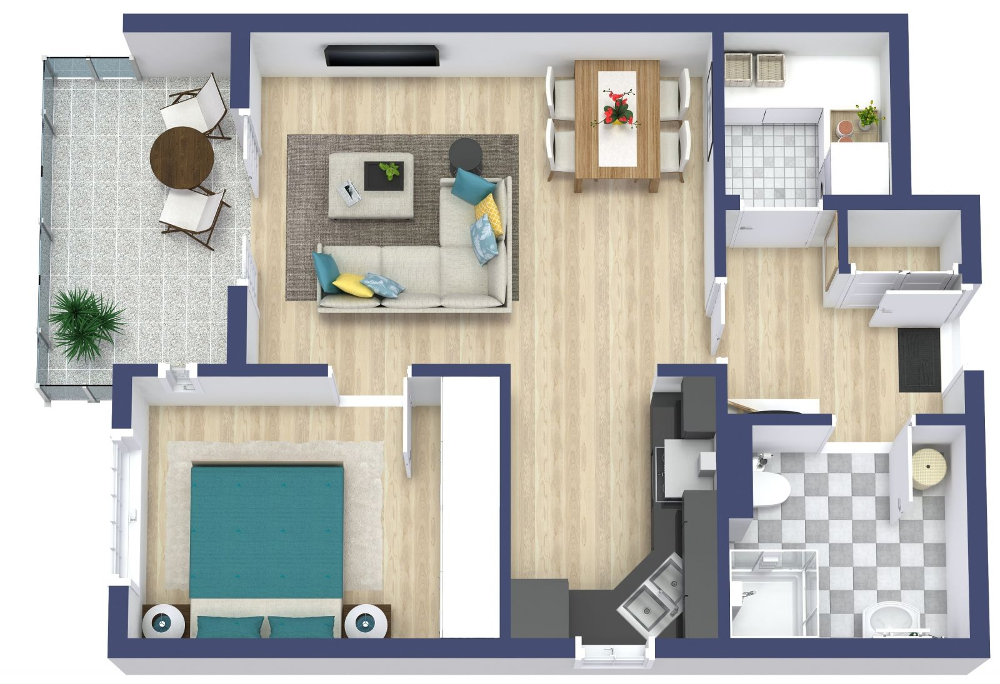
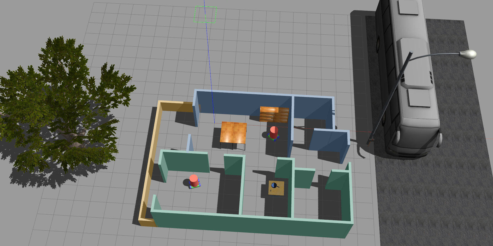

# gazebo_my_world

The First Project for the Udacity's "Robitics SW Engineer" Course.
The project is about creating a world in Gazebo. For this project a flat is modeled in gazebo and a sample plan is taken from [roomsketcher.com](https://www.roomsketcher.com/floor-plan-gallery/apartment/1-bedroom-apartment-plans/) (as shown below):

### Note:

Due to Gazebo crashes upon adding window/door (couldn't find a solution online); the flat doesn't have any of them!\
Here is the created world in gazebo (SeviceRobot is created using fix and revolute joints; other objects are imported from Gazebo online library):

## Project Structure

    .gazebo_my_world                   # Build My World Project
    ├── model                          # Model files
    │   ├── Building
    │   │   ├── model.config
    │   │   ├── model.sdf
    │   ├── ServiceRobot
    │   │   ├── model.config
    │   │   ├── model.sdf
    ├── script                         # Gazebo World plugin C++ script
    │   ├── welcome_msg.cpp
    ├── world                          # Gazebo main World containing models
    │   ├── myWorld.world
    ├── CMakeLists.txt                 # Link libraries
    └──

## Getting Started

- Copy this repo to your local drive:
  `git clone https://github.com/Jeyhooon/gazebo_my_world.git`
- Change directory to the copied repo: e.g.: `cd ~/git/gazebo_my_world`
- create the build directory: `mkdir build`
- `cd build`
- `cmake ../`
- `make`
- `export GAZEBO_PLUGIN_PATH=${GAZEBO_PLUGIN_PATH}:~/git/gazebo_my_world/build`
- `cd ~/git/gazebo_my_world/world`
- Run `gazebo myworld`

You should see a sentence on command line asking for your name; please enter your name.
Afterwards, you should see the gazebo environment shown in image above and also a welcome message in the terminal: `Welcome to <your_name>'s world!`
